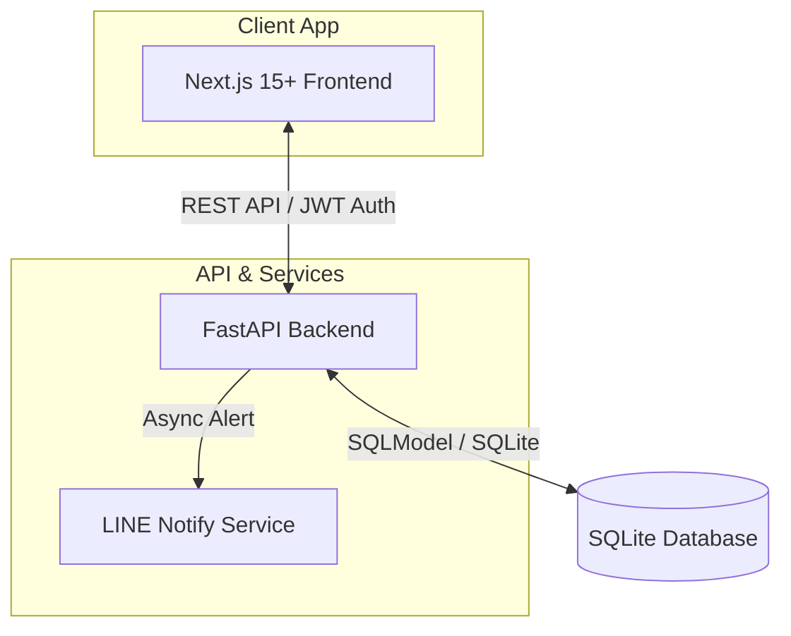

# Project Memory: U-Dash Pro Master Dashboard (Dashboard Line A)

เอกสารหลักสำหรับจัดเก็บ Project Context และภาพรวมการทำงานของระบบเพื่อรักษาความต่อเนื่องตามมาตรฐาน Obsidian Vault Architecture

## 📌 Architecture Overview

ระบบ U-Dash Pro เป็น Dual-Engine Dashboard ออกแบบภายใต้ Clean Architecture เชื่อมโยงระบบจัดการข้อมูลการค้าเข้ากับ LINE Notification และระบบรายงานวิเคราะห์ข้อมูล (Analytical Reports)

## ⚙️ Core Stack & Dependencies

### Frontend (Next.js App Router)
- **Framework:** Next.js 15.5.18, React 19
- **Styling:** Tailwind CSS v4 + @tailwindcss/postcss
- **Visualizations:** Recharts (Interactive trends)
- **Icons & Animations:** Lucide React, Framer Motion
- **Contexts:** `AppContext` (Categories, settings), `ToastContext` (Premium stacked notifications)

### Backend (FastAPI Engine)
- **Framework:** FastAPI
- **Database ORM:** SQLModel (SQLite wrapper)
- **Security:** JWT (pyjwt), Bcrypt (passlib)
- **Background Tasks:** Async worker calling LINE Notify API
- **Data Export:** UTF-8 BOM CSV Engine

---

## 🛠️ Key Technical Solves

### 1. Dual-Engine Sandbox Fallback (`frontend/src/lib/api.ts`)
ระบบรองรับการแสดงผลหน้าเว็บได้ แม้เซิร์ฟเวอร์ Backend จะปิดอยู่ โดยใช้ระบบดักจับข้อผิดพลาด `err.status === 0` (Network Offline) เพื่อดึงข้อมูล Mockup Sandbox ขึ้นมาแสดงผลโดยอัตโนมัติ แต่หากเกิด Server Error จริง (เช่น 400, 422, 500) ระบบจะสกัดกั้นและนำข้อผิดพลาดจริงไปแสดงบนหน้าจอ เพื่อความโปร่งใสในการพัฒนา

### 2. CSV Export UTF-8 BOM Compatibility
รายงาน CSV จาก backend ถูกจัดส่งด้วยรูปแบบ 2-in-1 hybrid (Executive Summary + Transaction Ledger) พร้อมแนบ UTF-8 BOM (`\xef\xbb\xbf`) เพื่อความเข้ากันได้กับการเปิดบน Microsoft Excel ของภาษาไทย 100%

---

## 🧭 Active State Tracking

- **Seeded Data:** ระบบจะจำลองข้อมูลยอดขายและค่าใช้จ่ายของร้านค้าสัญชาติไทยย้อนหลัง 14 วัน (เช่น หมวดหมู่ "ขายสินค้า", "ค่าวัตถุดิบ", "ค่าเช่าร้าน")
- **Initial Credentials:** 
  - Admin: `admin@udash.com`
  - Password: `udash2026`
